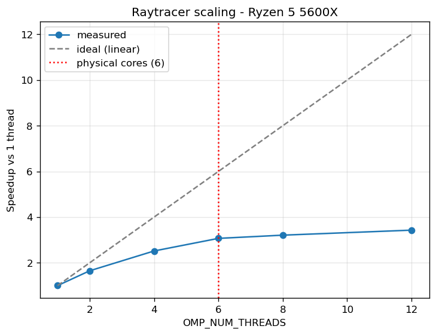

# CPU Raytracer - Optimization Log
A CPU raytracer, optimized step by step with measurements at each stage. Rows in the Results table are all single-threaded at the same scene and resolution, so they are directly comparable; threading results are measured separately in the Threading section.

## Test machine
| | |
|---|---|
| CPU | AMD Ryzen 5 5600X 6-Core Processor (znver3) |
| Compiler | c++ (Ubuntu 15.2.0-16ubuntu1) 15.2.0 |
| OS | Ubuntu 26.04.1 LTS |
| Scene | 7168 x 5376, unchanged since row 0 |
| Framebuffer | 38,535,168 px x 12 B (3 x `float`) = 462 MB, allocated once |

## Results
| Row | Change | Time (mean ± σ) | Speedup | IPC | Flags | imgdiff vs reference |
|---|---|---|---|---|---|---|
| 0 | Baseline, no changes | 6.474 s ± 0.008 s | 1.00× | 2.065 | `-O3 -DNDEBUG` | - (this is the reference) |
| 1 | No optimization | 135.699 s ± 3.293 s | 0.05× | 2.054 | `-O0` | 0 max Δ / 0 px |
| 2 | Standard optimization | 7.327 s ± 0.014 s | 0.88× | 1.973 | `-O2` | 0 max Δ / 0 px |
| 3 | Aggressive optimization | 6.463 s ± 0.018 s | 1.00× | 2.068 | `-O3` | 0 max Δ / 0 px |
| 4 | Target this CPU | 5.938 s ± 0.027 s | 1.09× | 1.914 | `-O3 -march=native` | 161 max Δ / 2326 px |

Speedup is row 0's time divided by this row's. Under 1.00× is a slowdown. All rows measured in one session on 2026-10-06 under the conditions in Method, and are directly comparable to each other. They are not comparable to the threaded times in the Threading section.

## Noise floor

Row 0's binary, identical in both cases, differing only in machine state:

| | mean | σ | σ / mean |
|---|---|---|---|
| Before hygiene | 5.131 s | 0.021 s | 0.41% |
| After hygiene | 6.474 s | 0.0075 s | 0.12% |

3.5× tighter in relative terms. The comparison has to be on the ratio, not on absolute σ: turning boost off raises the mean, so an unchanged relative spread would show a larger absolute σ and look like a regression. The cause is frequency -- with boost enabled the clock varied run to run with temperature and whatever else was awake; pinned at base clock it does not.

**Claim threshold: differences under 1% between rows are not claimed as real.** Within this session 3σ is roughly 0.4%, but cross-session drift has not yet been measured under these conditions, and the earlier 1.0% figure was taken with boost enabled and does not carry over. The threshold tightens once row 0's binary is re-measured on a later day with the same hygiene applied.

Rows 1, 2 and 4 are far outside the threshold and stand. Row 3 is not, and is addressed below.

### Where timing can't decide, counters can
Row 3 (`-O3`, 6.463 s) sits 0.17% from row 0 (`-O3 -DNDEBUG`, 6.474 s), inside the threshold, so timing alone cannot separate them. The counters can: the two binaries retire 48,700,752,855 and 48,698,742,121 instructions, a difference of 0.004%. They execute the same instruction stream. `NDEBUG` disables `assert()` and there are none in the render path, so there was nothing for it to remove.

Instruction count is nearly deterministic for the same binary on the same input, while wall time carries every source of noise listed in Method. When a timing difference lands inside the noise band, a counter is often still able to answer the question.

### Row 1 variance
Row 1 (`-O0`) has σ = 2.43% and triggered hyperfine's outlier warning, far above every other row. It runs for 135 s, so each run has roughly twenty times more opportunity to be interrupted, and ten runs plus warm-up is about 27 minutes of sustained load. It is kept as a measure of what the optimizer is worth and is not used for fine comparison.

## Allocations
Audited with `heaptrack` on both the `build-prof` binary (for the stack traces, which need debug info) and the `build` binary (to confirm the shipped build behaves the same). **10 allocations total, all of them setup; none in the per-pixel path.** No change was needed, so the before/after count is 10 -> 10.

| Count | Origin | Peak bytes |
|---|---|---|
| 3 | `std::vector<Sphere>` growth, `main.cpp:187-189` | 208 B |
| 3 | `std::vector<Light>` growth, `main.cpp:193-195` | 64 B |
| 1 | Framebuffer construction, `render()`, `main.cpp:143` | 462.42 MB |
| 1 | `ofstream::open` stream buffer, `main.cpp:159` | 8.19 KB |
| 1 | `fopen` `FILE` object under the same `open`, `main.cpp:159` | 472 B |
| 1 | libstdc++ initialisation, before `main` | 73.73 KB |

Peak heap 462.50 MB, 2 temporary allocations, 0 leaked.

Three allocations for four spheres is `std::vector` capacity doubling (1 -> 2 -> 4) as elements are pushed; the fourth push fits in space already held. Two of the three report 0 B peak because they were freed the moment the vector grew again and so were never alive at the high-water mark, allocation count and peak bytes are different questions.

Nothing allocates per pixel for two reasons. The scene data is passed by `const&` the whole way down (`render(const std::vector<Sphere>&, const std::vector<Light>&)` and below it), so no vector is ever copied, a copy would duplicate the heap block holding the elements, not just the 24-byte vector object. And the framebuffer is constructed once at full size on `main.cpp:143` rather than grown pixel by pixel.

Because there was no code change, there is no corresponding row in the Results table (a row showing an unchanged binary at an unchanged time would record noise, not a result). This section is the finding.

The framebuffer's 462 MB is far larger than this CPU's 32 MiB L3, so every pixel write goes to DRAM. That is a consequence of the fixed scene resolution and is left alone deliberately; the cost will be quantified against measured cache and memory latencies later.

## Profile
Top three functions by self time, from `perf report --no-children --sort symbol` on the `build-prof` binary (`-O2 -g -fno-omit-frame-pointer`). Self time is samples where that function's own instructions were executing, excluding time inside its callees (it's what's actually worth optimizing).

| Function | Self time |
|---|---|
| `scene_intersect` | 63.72% |
| `cast_ray` | 14.66% |
| `render` | 6.37% |

Full graph: [`flame0.svg`](flame0.svg).

## Threading

> Measured 2026-10-05 with boost enabled. Not comparable to the Results table above. Re-measurement pending.

The render loop is parallelized with `#pragma omp parallel for schedule(dynamic, 1)` over image rows. Dynamic scheduling is used because rows are not equally expensive (rows crossing the glass sphere spawn recursive reflection and refraction rays, while background rows return immediately). Output is pixel-identical to `reference.ppm` (imgdiff 0 max Δ / 0 px), so the parallel version is correct.

Measured speedup reaches 3.07× at 6 threads against an ideal 6×, and only 3.43× at 12. The curve falls away from ideal immediately (1.64× at 2 threads) so hyperthreading is not the main cause; it cannot apply below the physical core count. The dominant cause is the serial fraction. Timing the three phases separately, frameBuffer allocation (which zero-fills 460 MB) and the single-threaded PPM write take 985ms of the 5213ms single-threaded total, or 18.9%. Neither shrinks with thread count: going from 1 to 12 threads, the render loop drops from 4228 ms to 532 ms while alloc and write stay at 164/821 ms and 171/808 ms, leaving the serial portion at 64.8% of the 12-thread run. By Amdahl's law an 18.9% serial fraction caps speedup at about 5.3× regardless of core count. Hyperthreading explains the further flattening past 6 threads, where additional logical threads share execution units with a sibling rather than getting their own core. Turbo frequency likely falls as more cores wake and would flatten the curve further, but frequency control isn't in place yet, so I can't separate it from the other two.

## Floating point
`-march=native` lets the compiler emit fused multiply-add, which computes `a*b + c` with one rounding instead of two. Results differ in the last bits. At 2326 pixels, that difference crossed an object boundary in the ray-sphere intersection test, flipping hit to miss, so those pixels changed shade. The image is not pixel-identical to the reference, but it is not less correct (FMA is the more accurate of the two).

Row 4 also retires 15% fewer instructions than row 3 (41.32 G vs 48.70 G) while its IPC falls from 2.068 to 1.914. Fewer instructions over fewer cycles can lower IPC even as the work finishes sooner, which is why IPC is read here as a diagnostic rather than as a score.

## Method

All rows measured 2026-10-06 under the conditions below. Numbers from earlier sessions were discarded rather than carried forward: the machine state changed, so they are not comparable to these.

### Machine
| | |
|---|---|
| CPU | AMD Ryzen 5 5600X, 6 cores / 12 threads (znver3) |
| Base / max boost | 3.7 GHz / 4.6 GHz |
| L1 | 32 KiB d + 32 KiB i per core |
| L2 | 512 KiB per core |
| L3 | 32 MiB, shared across all 6 cores |
| RAM | 16 GB |
| OS | Ubuntu 26.04.1 LTS, kernel 7.0.0-34-generic |
| Compiler | g++ (Ubuntu 15.2.0-16ubuntu1) 15.2.0 |

### Machine state during measurement
Not defaults. Each control removes one source of run-to-run variation. Applied with `tools/bench-hygiene.sh`, which must be re-run after every reboot:

| Control | Setting | Removes |
|---|---|---|
| Governor | `performance` | the clock ramping up and down with load |
| Boost | `/sys/devices/system/cpu/cpufreq/boost` = 0 | opportunistic clocks that vary with temperature and how many cores are awake |
| Affinity | `taskset -c 2` on all single-threaded runs | the scheduler migrating the thread to another core mid-run, and the cold caches that follow |

Verified rather than assumed. Dividing each row's cycle count by its elapsed time gives the clock it actually ran at:

| Row | Implied clock |
|---|---|
| 0 | 3.642 GHz |
| 1 | 3.667 GHz |
| 2 | 3.643 GHz |
| 3 | 3.643 GHz |
| 4 | 3.626 GHz |

Five rows within 1.1% of each other and all just under the 3.7 GHz base clock, consistent with `/proc/cpuinfo` read during a run.

These settings make the machine slower in absolute terms. Row 0's binary ran at 5.131 s with boost enabled and runs at 6.474 s without it. That 1.26× ratio is entirely frequency: 3.642 GHz × 1.26 = 4.59 GHz, this CPU's rated max boost. The trade is deliberate, absolute speed is given up for comparability between rows, and no time here should be read as this CPU's best achievable.

Not controlled: ASLR, thermal drift across a long session, background daemons, and cross-session variation.

### Workload
7168 x 5376, fixed since row 0 and never changed. `reference.ppm` is row 0's output and is the correctness oracle for every other row.

### Timing
`hyperfine --warmup 2 --runs 10`, reported as mean ± σ. The warm-up runs absorb first-touch page faults, the binary entering the page cache, and cache warming (none of which recur in steady state).

### Counters
`perf stat -e cycles,instructions`, one run per row, same pinning. IPC = instructions ÷ cycles. IPC is frequency-independent, so it serves as a cross-check: it should barely move when only the clock changes, and across the governor change it shifted by at most 0.03 on every row.

### Correctness
`tools/imgdiff.py` against `reference.ppm` on every row, reported as max per-channel difference / differing pixel count. A pass is 0 / 0. Row 4 does not pass; the reason is in the Floating point section. imgdiff compares pixel values and is unaffected by machine state, so these were not re-run when the timings were.

### Build directories
Two build directories, used for different questions and never interchanged:

| | `build` | `build-prof` |
|---|---|---|
| Flags | `Release` (`-O3 -DNDEBUG`) | `RelWithDebInfo` + `-fno-omit-frame-pointer` |
| Answers | how fast is it | where is it happening |
| Tools | `hyperfine`, `perf stat` | `perf record`, `heaptrack` |

Attribution tools need debug info to map an address to a source line and a kept frame pointer to walk the stack, both of which cost a little speed, so no timing is ever quoted from `build-prof` and no stack trace from `build`. The allocation count was checked on both and matched at 10.

One build directory per flag set for rows 1-4, each configured with `-DCMAKE_BUILD_TYPE=None` so `CMAKE_CXX_FLAGS` is the complete flag set. Row 0 is the original `Release` build.

Phase timings (alloc / render / write) come from `std::chrono::steady_clock` around each section of `render()`, printed to stderr on every run.