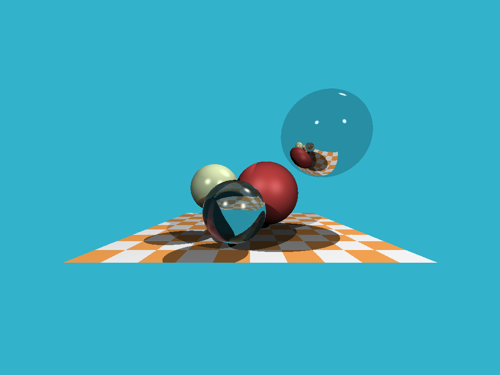

# tinyraytracer (my version)

A small CPU raytracer in C++20. Renders spheres with diffuse, specular, reflection, refraction, shadows and a checkerboard floor, then writes a `.ppm` image.



## About

Inspired by [ssloy's tinyraytracer](https://github.com/ssloy/tinyraytracer) — *"Understandable RayTracing in 256 lines of bare C++"*.

I didn't copy the code. I read the lessons first, took notes, then wrote the whole thing from scratch using only those notes. So the structure and naming are my own.

## Build & Run

```bash
g++ -std=c++20 -O2 main.cpp -o raytracer
./raytracer
```

Outputs `out.ppm` in the same folder. Open it with GIMP, IrfanView, or convert it:

```bash
magick out.ppm out.png
```

## Files

| File | What it does |
|---|---|
| `main.cpp` | Ray casting, reflection/refraction, shading, render loop |
| `vec.hpp` | Templated N-dimensional vector math |
| `sphere.hpp` | Sphere + ray-sphere intersection |
| `material.hpp` | Albedo, diffuse color, specular exponent, refractive index |
| `light.hpp` | Point light |

## Notes

- Resolution and FOV are set at the top of `render()` and `main.cpp`.
- Recursion depth for reflection/refraction is capped at 4.
- Scene is hardcoded in `main()` — edit the spheres and lights there.

---

# CPU Raytracer - Optimization Log
A single-threaded CPU raytracer, optimized step by step with measurements at each stage. Every row below is the same scene at the same resolution, so the times are directly comparable.

## Test machine
| | |
|---|---|
| CPU | AMD Ryzen 5 5600X 6-Core Processor |
| Compiler | c++ (Ubuntu 15.2.0-16ubuntu1) 15.2.0 |
| OS | Ubuntu 26.04.1 LTS |
| Scene | 7168 x 5376, unchanged since row 0 |

## Results
| Row | Change | Time (mean ± σ) | IPC | Flags | imgdiff vs reference |
|---|---|---|---|---|---|
| 0 | Baseline, no changes | 5.120 s ±  0.012 s | 2.06 | `-O3 -DNDEBUG` | - (this is the reference) |

## Method 
Timins from `hyperfine --warmup 2 --runs 10`. Counters from `perf stat -e cycles,instructions`. IPC is (instructions / cycles).